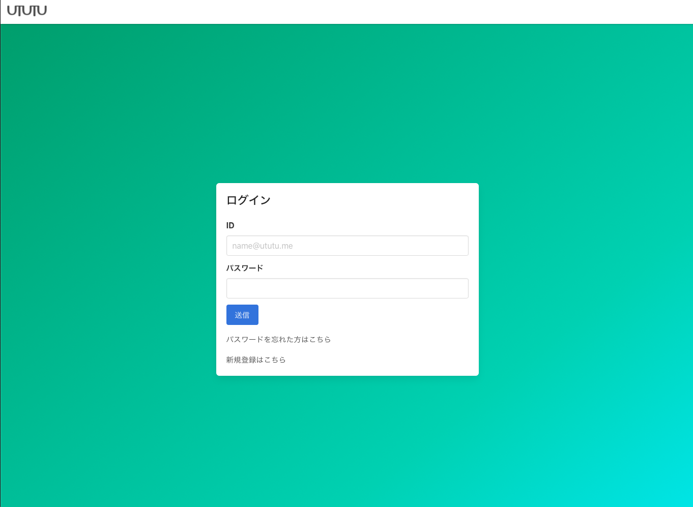
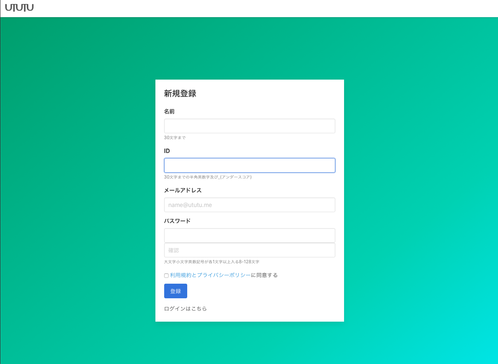
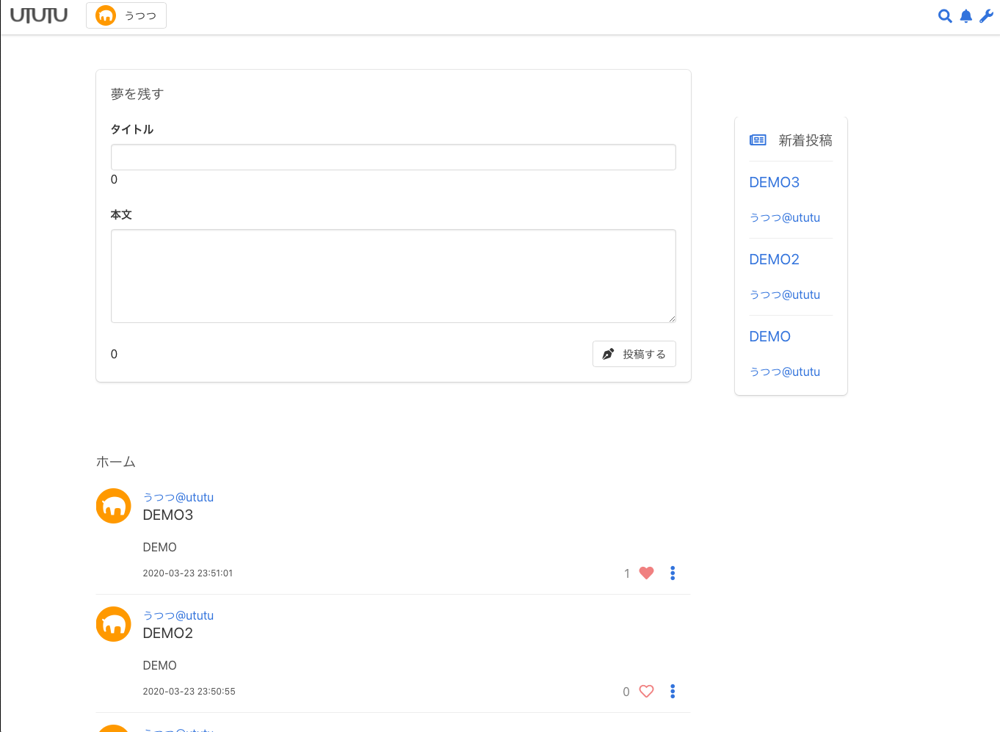
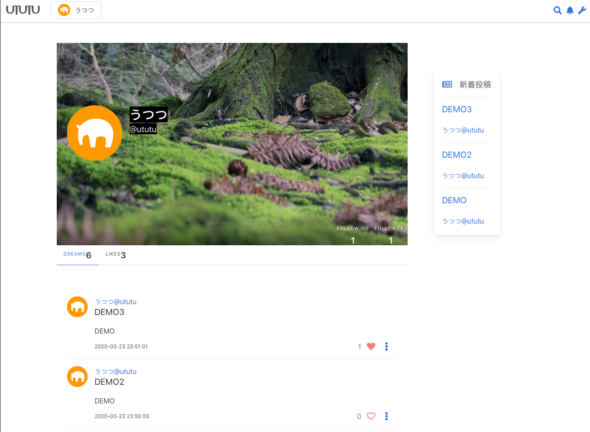
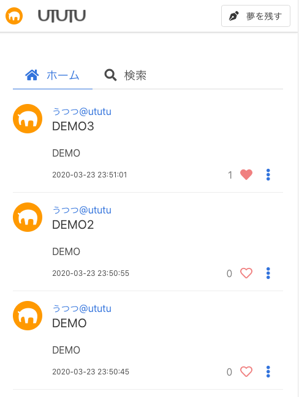

UTUTU
====

UTUTUは夢日記を投稿する掲示板風SNSです｡PHP+JQuery+MySQLで動作します｡

https://ututu.me で稼働しています｡

ユーザが投稿した記事の閲覧はログイン不要で次のURLから閲覧できます( `https://ututu.me/dream.php?id=[任意の自然数]` )が､より多くの機能の利用にはユーザ登録が必要です｡

## 主な機能
- 投稿機能(タイトル25字以内､本文400字以内)
- フォロー機能
- 新着投稿一覧(非フォロー含む)
- いいね

## Framework
- JQuery (JavaScript) (https://github.com/jquery/jquery)
- Bulma (CSS) (https://github.com/jgthms/bulma)

## Demo
### Top

### ログインフォーム

### 新規登録フォーム

### ホームタイムライン

### ユーザページ

### レスポンシブに対応

## Author

Eisuke Ishikawa.